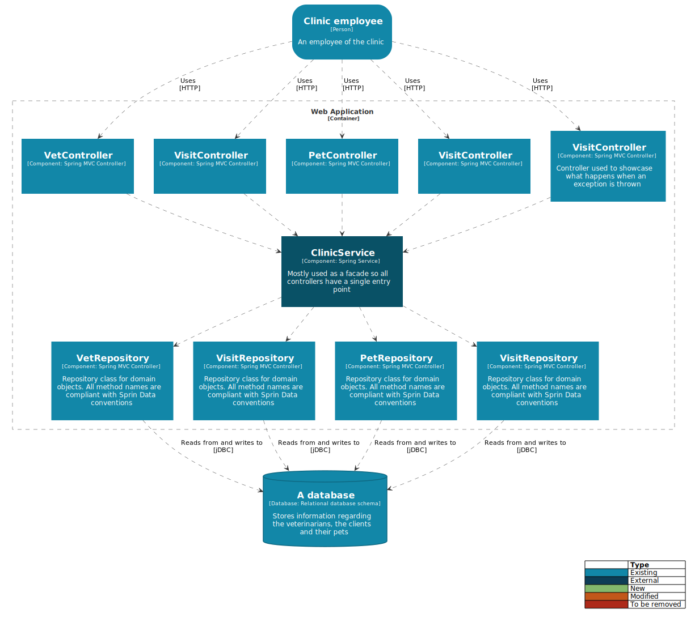
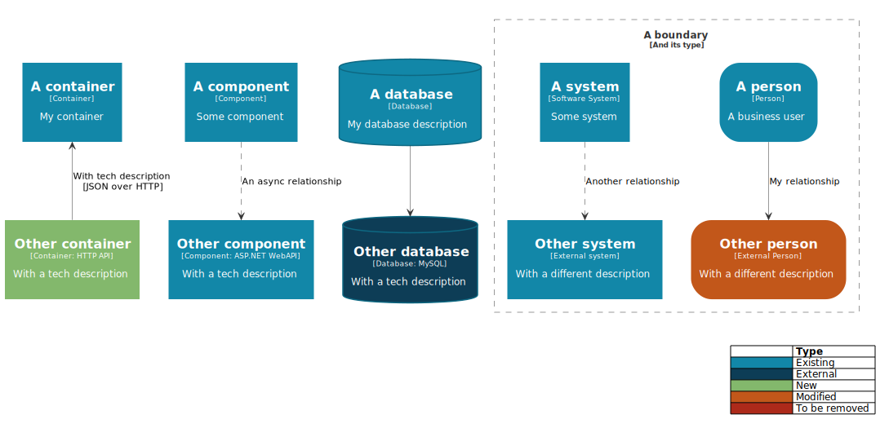

# PlantUML template for C4 diagrams

Taking inspiration from the [PlantUML C4 templates](https://github.com/RicardoNiepel/C4-PlantUML) by Ricardo Niepel, this [C4](https://c4model.com/) [PlantUML](https://plantuml.com/) template includes styling similar to that used by the [C4 samples](https://c4model.com/#CoreDiagrams) and [Structurizr](https://structurizr.com/), and maintains a close relationship to the PlantUML core syntax.

## Key features

* C4 and Structurizr styling
* Relationship styling and flexibility enabling better control of layout
* A single include file - simple to reference or modify

## Getting started

Include the line below at the beginning of your PlantUML file, under the `@startuml` directive:

    !include https://raw.githubusercontent.com/robbell/plantuml-c4/v1.0/c4.puml

### Example

```
@startuml Sample Context diagram 
!include https://raw.githubusercontent.com/robbell/plantuml-c4/v1.0/c4.puml

Person("Clinic employee", "An employee of the clinic") as clinicEmployee
System("Pet Clinic Application", "System for managing vet appointments") as petClinicSystem
clinicEmployee ..> petClinicSystem : Uses

@enduml
```

## Sample Component diagram

Source: [samples/pet-clinic-sample.puml](samples/pet-clinic-sample.puml)



## Sample entity usage

Source: [samples/entities-sample.puml](samples/entities-sample.puml)



## Related

To add **PlantUML** diagram generation to your build pipelines, take a look at my [PlantUML in Docker](https://github.com/robbell/plantuml-docker) project.

## To do

- [ ] Style toggling to core PlantUML
- [ ] Key toggling
- [ ] Continued refactoring
- [x] Additional functions for remaining Context entities, and all other entities at the Container and Component level
- [x] Update current implementations to more closely resemble vanilla PlantUML syntax
- [x] Relationship directions
- [x] Layout helpers using -[hidden]->
