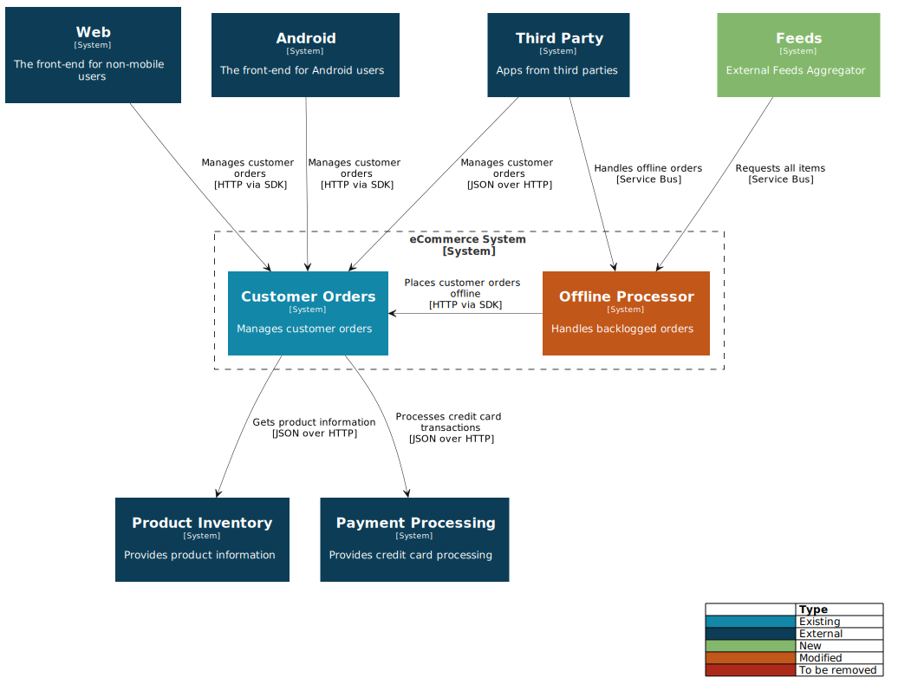

# PlantUML template for C4 diagrams

Taking inspiration from the [PlantUML C4 templates](https://github.com/RicardoNiepel/C4-PlantUML) by Ricardo Niepel, this [PlantUML](https://plantuml.com/) template includes styling similar to that used by the [C4 samples](https://c4model.com/#CoreDiagrams) and [Structurizr](https://structurizr.com/), and maintains a close relationship to the PlantUML core syntax.

## Key features

* C4 and Structurizr styling
* Relationship styling and flexibility enabling better control of layout
* A single include file - simple to reference or modify

## Sample Context diagram

Source: [sample.puml]()

## Related

To add **PlantUML** diagram generation to your build pipelines, take a look at my [PlantUML in Docker](https://github.com/robbell/plantuml-docker) project.

## To do

- [ ] Additional functions for remaining Context entities, and all other entities at the Container and Component level
- [ ] Update current implementations to more closely resemble vanilla PlantUML syntax
- [ ] Additional styling options https://plantuml.com/class-diagram#Skinparam
- [ ] Layout helpers `together`
- [x] Relationship directions
- [x] Layout helpers using -[hidden]->
